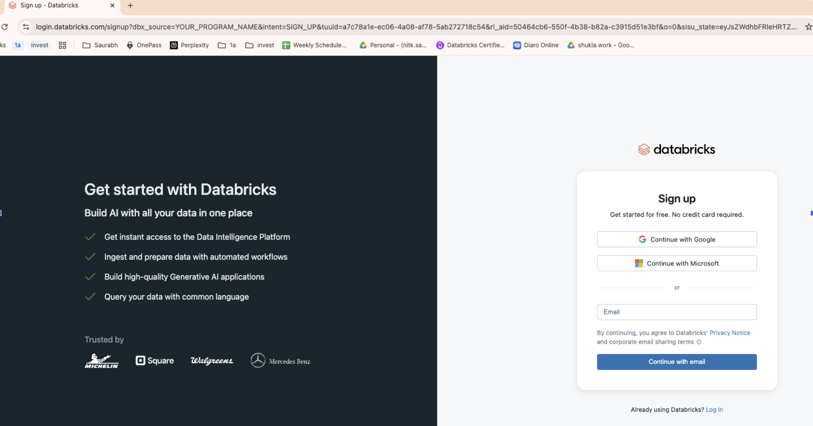
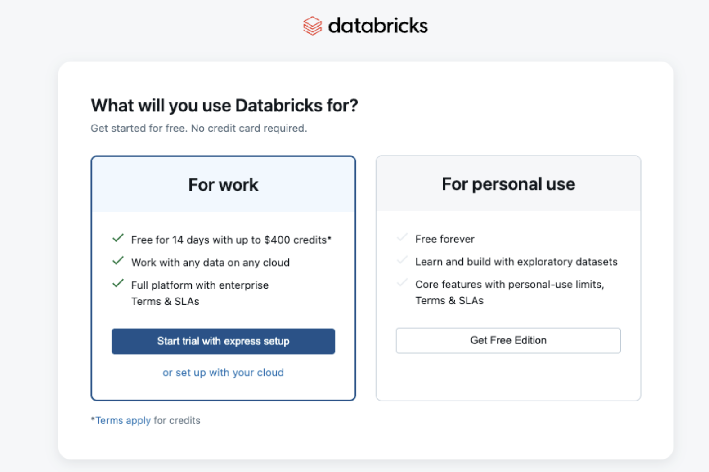
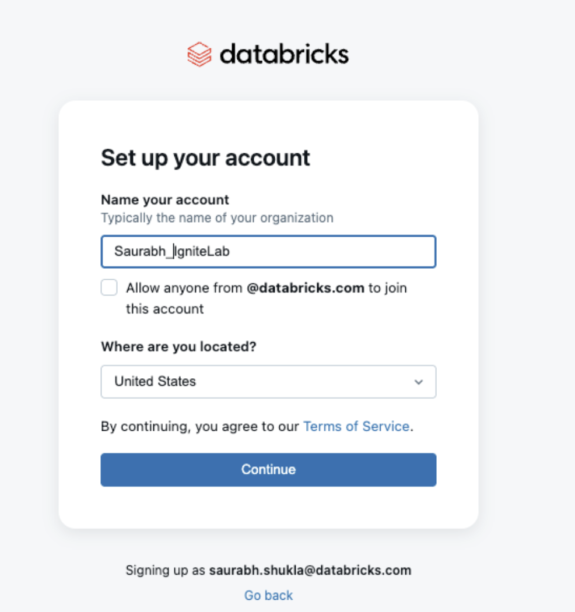

# Sign Up for Databricks Free Edition

Follow these simple steps to create your free Databricks account:

## Step 1: Visit the Signup Page

Go to the Databricks Free Edition signup page:

**https://login.databricks.com/?dbx_source=YOUR_PROGRAM_NAME&intent=SIGN_UP**

## Step 2: Create Your Account

1. **Pick "For work" and "Start trial with express setup".**

2. **Provide your email address** and Enter Verification Code.
   Click **"Create a new account"**
   Fill in your details:
   - Name your account
   - Where are you located
   - Click **"Continue"**

