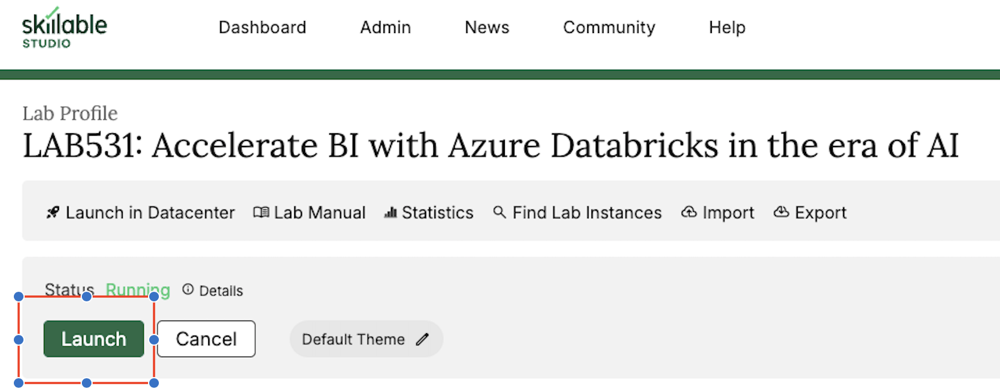
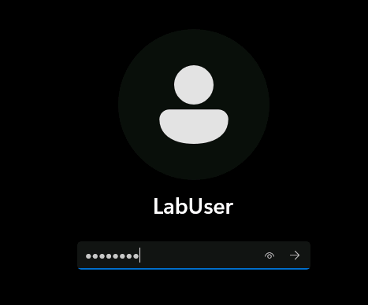
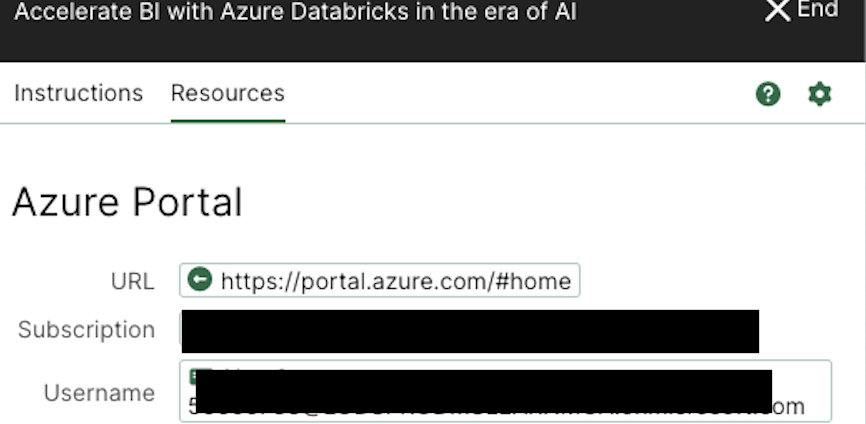
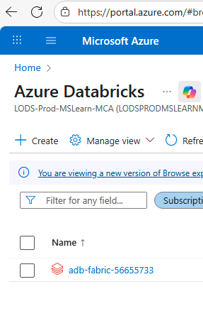
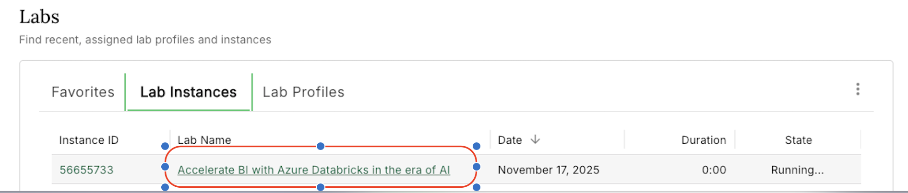

# Lab on Demand - Signup Instructions

## Overview

This lab uses **Skillable Lab on Demand** - a hosted environment with pre-configured Azure Databricks workspace. 

---

## Step 1: Access Lab Profile

1. Navigate to the lab URL: **https://labondemand.com/LabProfile/198123**
2. You'll see the lab profile page:

   

3. Click the **Launch** button to start your lab instance

---

## Step 2: Sign in to the Lab Portal

1. When prompted for authentication, select **Entra ID**
2. Your lab instance will be provisioned (this takes ~2-3 minutes)

---

## Step 3: Lab User Credentials

1. Use the credentials shown in "instructions" section for Windows login screen:

   

2. Open the **Resources** tab in the lab pane to view portal and workspace details:

   

---

## Step 4: Open Azure Databricks Workspace

1. In the lab VM, open a browser and paste the **Azure Portal URL** from the Resources tab (Step 3)
2. Sign in with the **Username** and **Password** from the Resources tab
3. In the Azure Portal, navigate to the pre-provisioned Databricks workspace (e.g., `adb-fabric-...`)

   

4. Click **Launch Workspace** to open your Databricks environment
5. This workspace is where you'll complete all lab steps

---

## Step 5: Verify Lab Resources

1. Once launched, you'll see your running lab instance:

   

2. The lab provides:
   - Pre-configured Azure Databricks workspace
   - Sample data and resources
   - Access duration: Check your lab instance timer for time remaining

---

## What's Next?

Once your lab is running and you've verified access to the Azure Databricks workspace, return to the main README and complete the [Prerequisites](README.md#prerequisites) section before starting the workshop.

---