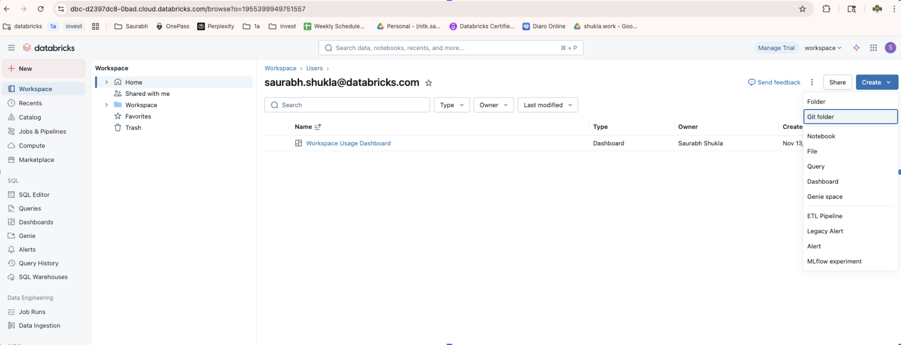
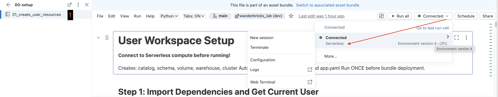
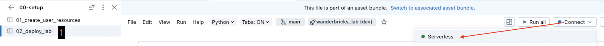
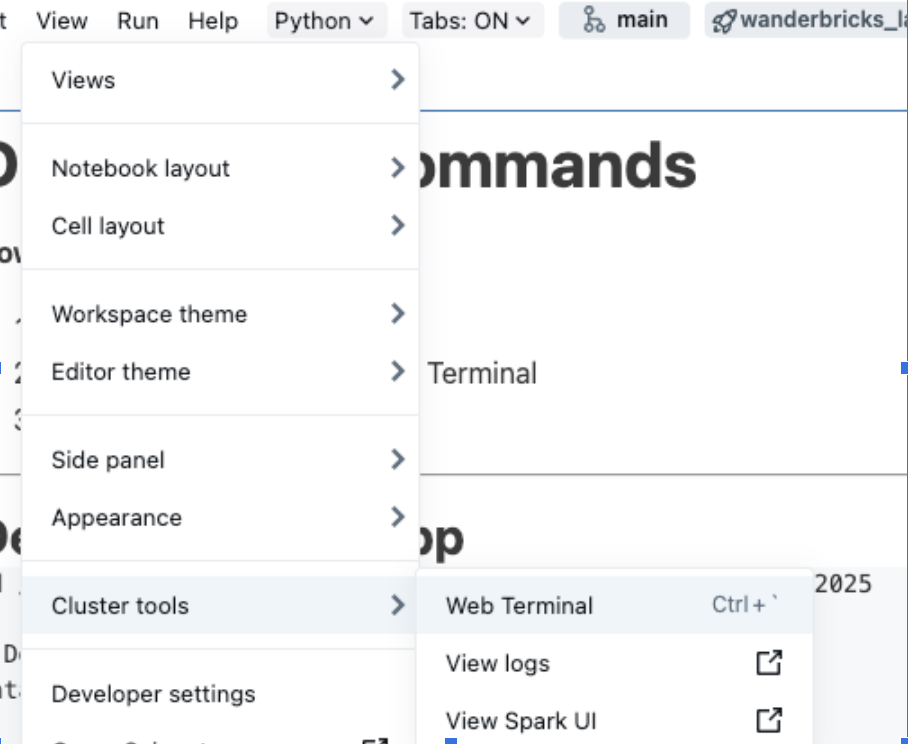
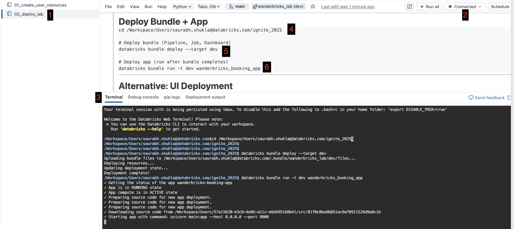

<p align="center">

</p>

# [Microsoft Ignite 2025](https://ignite.microsoft.com)

## 🔥LAB531: Accelerate BI with Azure Databricks in the Era of AI

[](https://aka.ms/AIFoundryDiscord-Ignite25)
[](https://aka.ms/AIFoundryForum-Ignite25)
[](https://community.databricks.com/)

### Session Description

In this hands-on lab, you'll build a complete end-to-end data and analytics solution using Azure Databricks and the Microsoft Power BI platform. Using the fictional "Wanderbricks" vacation rental marketplace as your business scenario, you'll transform raw booking data into actionable insights through a modern lakehouse architecture.

You'll create real-time data pipelines with Lakeflow (Databricks' declarative pipeline framework), implement enterprise data governance with Unity Catalog, build AI-powered dashboards using Genie and Lakeview, and integrate with Power BI for business intelligence reporting. By the end of this 90-minute workshop, you'll have deployed a production-ready data platform including automated ETL, semantic layers, natural language query capabilities, and a full-stack web application.

This beginner-friendly workshop requires no local installation—everything runs in your browser using Azure Databricks serverless compute and SQL warehouses.

### 🧠 Learning Outcomes

By the end of this session, learners will be able to:

- Build automated data pipelines using Lakeflow with built-in data quality checks and change data capture (CDC)
- Implement enterprise data governance using Unity Catalog with catalogs, schemas, and row-level security
- Create semantic layers with Databricks Metric Views for standardized business definitions
- Build interactive dashboards with Lakeview and enable natural language queries with Genie AI
- Integrate Azure Databricks with Power BI using DirectQuery for real-time business intelligence
- Deploy full-stack applications on Databricks Apps with FastAPI and React
- Apply medallion architecture patterns (Bronze/Silver/Gold) for lakehouse data organization

### 💻 Technologies Used

1. **Azure Databricks** - Unified analytics platform
2. **Unity Catalog** - Data governance and security
3. **Lakeflow Spark Declarative Pipeline** - Automated ETL pipelines (formerly Delta Live Tables)
4. **Databricks SQL** - SQL analytics engine
5. **Lakeview** - Native BI dashboarding
6. **Genie AI** - Natural language query interface
7. **Databricks Apps** - Full-stack application hosting
8. **Microsoft Power BI** - Business intelligence reporting
9. **Delta Lake** - Open table format for lakehouse
10. **Apache Spark** - Distributed data processing

### 🌟 Microsoft Learn MCP Server

[](https://vscode.dev/redirect/mcp/install?name=microsoft.docs.mcp&config=%7B%22type%22%3A%22http%22%2C%22url%22%3A%22https%3A%2F%2Flearn.microsoft.com%2Fapi%2Fmcp%22%7D)

The Microsoft Learn MCP Server is a remote MCP Server that enables clients like GitHub Copilot and other AI agents to bring trusted and up-to-date information directly from Microsoft's official documentation. Get started by using the one-click button above for VSCode or access the [mcp.json](.vscode/mcp.json) file included in this repo.

For more information, setup instructions for other dev clients, and to post comments and questions, visit our Learn MCP Server GitHub repo at [https://github.com/MicrosoftDocs/MCP](https://github.com/MicrosoftDocs/MCP). Find other MCP Servers to connect your agent to at [https://mcp.azure.com](https://mcp.azure.com).

*Note: When you use the Learn MCP Server, you agree with [Microsoft Learn](https://learn.microsoft.com/en-us/legal/termsofuse) and [Microsoft API Terms](https://learn.microsoft.com/en-us/legal/microsoft-apis/terms-of-use) of Use.*

### 📚 Resources and Next Steps

| Resources          | Links                             | Description        |
|:-------------------|:----------------------------------|:-------------------|
| Ignite 2025 Next Steps | [https://aka.ms/Ignite25-Next-Steps](https://aka.ms/Ignite25-Next-Steps?ocid=ignite25_nextsteps_cnl) | Links to all repos for Ignite 2025 Sessions |
| Azure AI Foundry Community Discord | [](https://aka.ms/AIFoundryDiscord-Ignite25)| Connect with the Azure AI Foundry Community! |
| Learn at Ignite | [https://aka.ms/LearnAtIgnite](https://aka.ms/LearnAtIgnite?ocid=ignite25_nextsteps_github_cnl) | Continue learning on Microsoft Learn |
| Databricks Academy | [https://www.databricks.com/learn](https://www.databricks.com/learn) | Free online training courses |
| Databricks Community | [https://community.databricks.com/](https://community.databricks.com/) | Ask questions and share knowledge |

## Content Owners

<table>
<tr>
    <td align="center"><a href="http://github.com/saurabhshukla-db">
        <br />
        <sub><b>Saurabh Shukla</b></sub></a><br />
            <a href="https://github.com/saurabhshukla-db" title="talk">📢</a>
    </td>
    <td align="center"><a href="http://github.com/isaac-gritz">
        <br />
        <sub><b>Isaac Gritz</b></sub></a><br />
            <a href="https://github.com/isaac-gritz" title="talk">📢</a>
    </td>
    <td align="center"><a href="http://github.com/Slcc2c">
        <br />
        <sub><b>Spencer Cook</b></sub></a><br />
            <a href="https://github.com/Slcc2c" title="talk">📢</a>
    </td>
    <td align="center"><a href="http://github.com/bhagyashri333">
        <br />
        <sub><b>Bhagyashri Badgujar</b></sub></a><br />
            <a href="https://github.com/bhagyashri333" title="talk">📢</a>
    </td>
</tr>
</table>

---

# Workshop Guide

**Total Time:** 90 minutes | **Skill Level:** Beginner-friendly

---

## Workshop Timeline

```
0:00 - 0:05  │ Introduction
0:05 - 0:15  │ Setup: Import repo, configure, deploy
0:15 - 0:45  │ Lab 01: Build Lakeflow pipeline (dimensions + facts)
0:45 - 1:00  │ Lab 02: Unity Catalog & metric view (governance)
1:00 - 1:10  │ Lab 03: AI/BI dashboards (Lakeview/Genie)
1:10 - 1:17  │ Databricks App: Deploy & open app
1:17 - 1:24  │ Power BI: Connect to warehouse, quick report
1:24 - 1:30  │ Wrap-up, Q&A, next steps
```

---

## Prerequisites

**No local installation required!** Everything runs in your browser.

**Required:**
- Databricks workspace access (URL from instructor)
  - **You can also run this lab in Databricks Community Edition** - [Sign up steps here](DATABRICKS_SIGNUP.md) (free, no credit card required)
- Source data access: `samples.wanderbricks`

**Recommended:**
- Lakeflow Pipelines Editor enabled (Admin → Previews → Lakeflow Pipelines Editor) - [Docs](https://docs.databricks.com/en/ldp/multi-file-editor)

---

## Quick Start Guide

Follow these steps carefully. Each step includes success checkpoints and troubleshooting.

### Step 1: Import Workshop Code

**Instructions:**
1. In Databricks workspace, click **Workspace** in the left sidebar
2. Click the blue **Create** button (near the bottom)

   

3. Click **Git Folder** button
4. Paste the Git URL provided by your instructor
5. Click **Create Git Folder**

**Success Checkpoint:**
- New folder with Git icon named `ignite_2025`
- Contains `databricks.yml`, `lab/`, `resources/`

**Common Issues:**
- **"Repos not found"**: Repos is not enabled. Ask instructor to enable it.
- **"Authentication failed"**: For private repos, add credentials in User Settings → Git Integration.

---

### Step 2: Run Setup Notebook

**Instructions:**
1. In your imported repo, navigate to **lab** → **00-setup**
2. Open the **01_create_user_resources** notebook
3. **IMPORTANT:** Connect to **Serverless** compute (top-right dropdown → Select "Serverless")

   

4. Click **Run All** at the top (or press Shift+Enter on each cell)
5. Wait for all cells to complete (~2-3 minutes)
6. Scroll to the **final output** (Step 10)

**What this creates:**
- 📁 Catalog: `ignite_2025`
- 📂 Your personal schema: `ignite_2025.<your_username>`
- 💾 Volume: `ignite_2025.<your_username>.file_data`
- 🔌 SQL Warehouse: `Serverless Starter Warehouse` - 2X-Small (auto-created if needed)
- 📝 Deployment guide notebook: `02_deploy_lab.py` (auto-generated with your repo path, works with Serverless)

**Success Checkpoint:**
- All cells complete with green checkmarks
- Final output shows catalog, schema, volume, warehouse ID
- Configuration auto-updated in `databricks.yml` and `app.yaml`

**Common Issues:**
- **"Permission denied - CREATE CATALOG"**: Instructor needs to grant catalog creation permission or pre-create the catalog
- **"current_user() returns null"**: You'll need to hardcode your schema name in the next step
- **"ModuleNotFoundError: databricks.sdk"**: You're not connected to Serverless compute - switch to Serverless in the compute dropdown


---

### Step 3: Verify Configuration (1 minute)

**Optional:** If the setup notebook showed an error with `current_user()`:
- Search for `schema:` in the variables section
- Comment it out by adding `#` at the start
- Add a new line: `schema: your_username` (use your actual username)

**Success Checkpoint:**
- `warehouse_id` is filled (not `PLACEHOLDER_WAREHOUSE_ID`)

**Common Issues:**
- **Still shows PLACEHOLDER_WAREHOUSE_ID**: Setup notebook Step 12 failed - manually copy warehouse ID from Step 2 output and paste it

---

### Step 4: Deploy Workshop Resources

**Recommended: CLI Method (via Web Terminal)**
1. Open the auto-generated notebook: `lab/00-setup/02_deploy_lab.py`
2. Connect to **Serverless** compute

   

3. Go to **View → Cluster Tools → Web Terminal**

   

4. Run the deployment commands shown in the notebook

   

**Alternative: UI Method**
1. Make sure you're in the **repo folder** (should see Git icon)
2. Click **📁 Actions** menu → **Databricks Asset Bundles** → **Deploy**
3. Choose target: **dev**
4. Wait for deployment to complete (~1-2 minutes)

**Note:** You must be in a Git folder (Repos) for bundle deployment to work.

**What gets deployed:**
- 🔄 **Lakeflow Pipeline**: `[dev your_name] wanderbricks_lab_etl`
- 📋 **Orchestration Job**: `[dev your_name] wanderbricks_lab_job`
- 📊 **Dashboard**: `[dev your_name] Wanderbricks Bookings Dashboard`

**Success Checkpoint:**
- "Deployment complete!" message with no errors
- Job visible in **Workflows**: `[dev your_name] wanderbricks_lab_job`

**Common Issues:**

| Issue | Cause | Fix |
|-------|-------|-----|
| "Databricks Asset Bundles" not in Actions menu | Not in Git folder | Go back to Repos folder, not workspace folder |
| "Catalog not found" | Setup step didn't complete | Re-run setup notebook from Step 2 |
| "Invalid warehouse_id" | Wrong ID in databricks.yml | Check warehouse ID from Step 2 |
| "Permission denied" | Missing Unity Catalog permissions | Ask instructor for help |

---

### Step 5: Run Workshop Job

**Instructions:**
1. Click **Workflows** in the left sidebar
2. Find your job: `[dev your_name] wanderbricks_lab_job`
3. Click the job name to open it
4. Click the blue **Run Now** button (top right)
5. Watch the job progress in real-time

**What happens (in order):**
1. **Task 1 - Pipeline Full Refresh** (~3-4 minutes):
   - Triggers the Lakeflow pipeline with **full refresh** (rebuilds all tables from scratch)
   - Creates 5 dimension tables + 1 fact table
   - This ensures a clean slate for the workshop
   - You can click into this task to see the pipeline flow diagram
2. **Task 2 - Metric View** (~1 minute):
   - Creates `wanderbricks_bookings_metrics` for AI/BI dashboards

**Success Checkpoint:**
- Job shows "Succeeded" with 2 green tasks
- Total runtime: ~4-6 minutes

**Common Issues:**
- **Job fails on Task 1**: Pipeline may have data quality issues - check pipeline logs
- **Task 2 fails**: Pipeline didn't complete - wait for Task 1 to finish first

---

### Step 6: Deploy Databricks App (Optional)

**Prerequisites:**
- Step 5 (job) must have completed successfully

**Recommended: CLI Method (via Web Terminal)**
1. Open the deployment guide: `lab/00-setup/02_deploy_lab.py`
2. Connect to **Serverless** compute
3. Go to **View → Cluster Tools → Web Terminal**
4. Run the app deployment command shown in the notebook

**Access your app:**
1. **Apps** in left sidebar → Find `wanderbricks-booking-app`
2. Click to open and explore:
   - Property search
   - AI assistant
   - Country manager dashboards

**Success:** App shows "Running" status and loads data

---


**Next:** Dive into the labs to understand what you built!

---

## Lab Modules

### Lab 01: Data Transformation with Lakeflow Pipeline

**🎯 What You'll Build:** A complete medallion architecture pipeline with 5 dimensions and 1 fact table
**💼 Business Value:** Transform raw booking data into analytics-ready tables with data quality guarantees

#### What is Lakeflow Spark Declarative Pipeline?

Lakeflow (formerly called Delta Live Tables / DLT) is Databricks' framework for building reliable, maintainable data pipelines. Think of it as "autopilot for data engineering" - you declare what tables you want and how they relate, and Lakeflow handles the complexity:
- Automatic dependency management
- Built-in data quality checks
- Change data capture (CDC) for tracking updates
- Automatic retries and error handling

#### Architecture: Medallion Layers

```
Bronze (Raw)               → Silver (Clean)           → Gold (Business)
samples.wanderbricks.bookings → dim_customer                → metric views
samples.wanderbricks.users    → dim_property                → dashboards
samples.wanderbricks.hosts    → dim_host
samples.wanderbricks.properties→ dim_employee
                              → dim_date
                              → fact_bookings (with CDC)
```

#### Step-by-Step Walkthrough

##### 1. Explore Dimension Tables

Open and review these files in [lab/01-Data-Transformation/transformations/](lab/01-Data-Transformation/transformations/):
- `dim_customer.py` - Customer dimension with region mapping and surrogate keys
- `dim_property.py` - Properties with amenities and pricing tiers
- `dim_host.py` - Hosts with ratings and management styles
- `dim_employee.py` - Employees with roles and tenure
- `dim_date.py` - Complete date dimension (2020-2030)

**Key patterns:** `@dp.materialized_view()`, `@dp.expect()` for data quality, `generate_sk()` for surrogate keys

##### 2. Explore Fact Table with CDC

Open [fact_bookings.py](lab/01-Data-Transformation/transformations/fact_bookings.py) to see:
- `dp.create_streaming_table()` for real-time data
- `dp.create_auto_cdc_flow()` for change data capture
- Dimension joins in `fact_bookings_enriched` view

##### 3. Shared Utilities

See [common_functions.py](lab/01-Data-Transformation/utilities/common_functions.py) for helper functions like `generate_sk()`, `get_region_udf()`, and `get_season()`

##### 4. Monitor Pipeline and Explore Data

1. **Workflows** → Click **wanderbricks_lab_etl** pipeline task
2. Explore **Lakeflow Pipeline UI** tabs: Flow diagram, Lineage, Data quality, Event log
3. **Data Explorer** → `ignite_2025` → `<your_schema>` → Browse tables
4. Query your data in **SQL Editor**: `SELECT * FROM ignite_2025.<your_schema>.dim_customer LIMIT 10;`

#### Success Criteria

- Pipeline completes with all tables green
- Can query 5 dimensions + 1 fact table in Data Explorer

#### Files Reference

- **Transformations:**
  - `lab/01-Data-Transformation/transformations/dim_customer.py`
  - `lab/01-Data-Transformation/transformations/dim_property.py`
  - `lab/01-Data-Transformation/transformations/dim_host.py`
  - `lab/01-Data-Transformation/transformations/dim_employee.py`
  - `lab/01-Data-Transformation/transformations/dim_date.py`
  - `lab/01-Data-Transformation/transformations/fact_bookings.py`

- **Views:**
  - `lab/01-Data-Transformation/transformations/booking_insights.sql` - Denormalized view
  - `lab/01-Data-Transformation/transformations/overlapping_bookings.sql` - Data quality

- **Utilities:**
  - `lab/01-Data-Transformation/utilities/common_functions.py`

---

### Lab 02: Data Governance with Unity Catalog


**What You'll Build:** Metric views for business users and Power BI integration
**Business Value:** Create a governed semantic layer with standardized metrics

#### What is a Metric View?

A metric view is Unity Catalog's way of creating a **semantic layer** - a business-friendly interface to your data:
- Standard definitions everyone agrees on
- Natural language synonyms for AI queries
- Reusable measures and dimensions
- Centralized governance

**Example:** Instead of each analyst writing different revenue calculations, everyone uses the same certified "Total Revenue" metric.

#### Step-by-Step Walkthrough

##### 1. Understanding Metric Views

**Open:** `lab/02-Data-governance/create_bookings_metrics_view.sql`

**What this creates:**

```sql
CREATE METRIC VIEW IF NOT EXISTS wanderbricks_bookings_metrics AS
SELECT
    -- Dimensions (things you GROUP BY)
    booking_id,
    destination COMMENT 'City where property is located' SYNONYM 'city',
    country,
    property_type SYNONYM 'accommodation type',

    -- Measures (things you SUM/COUNT/AVG)
    total_price METRIC COMMENT 'Total booking value in USD' SYNONYM 'revenue',
    total_nights METRIC COMMENT 'Number of nights booked',
    guests METRIC COMMENT 'Number of guests'
FROM fact_bookings
JOIN dim_property...
```

**Key elements:**
- **METRIC** keyword: Marks numeric measures
- **COMMENT**: Explains what it means
- **SYNONYM**: Alternative names for natural language queries

##### 2. Explore Your Metric View

**View the metric view:**

1. **Data Explorer** → `ignite_2025` → `<your_schema>` → `wanderbricks_bookings_metrics`
2. Click **Metrics** tab - see all available measures
3. Click **Dimensions** tab - see all grouping columns

**Query with natural language context:**

The metric view is now ready for Genie AI (Lab 03):
- "What's the total revenue by country?"
- "Show me average nights by property type"
- "Which city has the highest booking count?"

#### Success Criteria

- Metric view exists with metrics and dimensions tabs visible
- Can query metric view data

#### Files Reference

- `lab/02-Data-governance/create_bookings_metrics_view.sql`
- `lab/02-Data-governance/unity_catalog_features.md` — Catalog Explorer guide (UI-only) for `fact_bookings`

---

### Lab 03: AI/BI Analytics


**What You'll Build:** Interactive dashboard and AI-powered query interface
**Business Value:** Enable business users to explore data without writing SQL

#### Part A: Lakeview Dashboard

**What is Lakeview?**
Databricks' native BI tool for creating interactive dashboards - think Tableau but built into your data platform.

##### 1. Find Your Dashboard

1. Click **Dashboards** in the left sidebar
2. Search for: `[dev your_name] Wanderbricks Bookings Dashboard`
3. Click to open

**Note:** Your dashboard was automatically deployed in Step 4 of the Quick Start!

##### 2. Explore Dashboard Features

**Components you'll see:**
- KPI Cards: Total bookings, revenue, average nights
- Line Charts: Revenue over time, booking trends
- Maps: Geographic distribution of bookings
- Bar Charts: Top destinations, property types

**Interactive features:**
- **Filters**: Try filtering by date range, country, or property type
- **Drill-down**: Click on a chart to filter other visuals
- **Refresh**: Data updates automatically as pipeline runs

##### 3. Schedule and Share (Optional)

- **Schedule refresh**: Dashboard → Schedule → Daily at 6 AM
- **Share with team**: Dashboard → Share → Add users or groups
- **Subscribe**: Email me daily with latest metrics

#### Part B: Genie Space for Natural Language Queries

**What is Genie?**
Your AI data analyst - ask questions in plain English, get charts and insights automatically.

##### 1. Create Your Genie Space

1. Click **AI/BI** in the left sidebar
2. Click **Genie Spaces**
3. Click **Create Genie Space**

**Configuration:**
- **Name**: `Wanderbricks Booking Insights`
- **Description**: `Analyze vacation rental bookings, properties, and customer trends`
- **Data Source**: Select your metric view
  - `ignite_2025.<your_schema>.wanderbricks_bookings_metrics`
- Click **Create**

##### 2. Sample Questions to Try

**Revenue Analysis:**
- "What is the total revenue by country?"
- "Show me monthly revenue trends for 2024"
- "Which property type generates the most revenue?"

**Booking Patterns:**
- "What's the average booking length by destination?"
- "How many bookings do we have by month?"
- "Show me booking distribution by property type"

**Geographic Insights:**
- "What are the top 10 cities by booking count?"
- "Compare revenue between EMEA and Americas regions"
- "Which country has the highest average booking value?"

##### 3. Understanding Genie Responses

For each query, Genie shows:
1. **SQL Query**: See what Genie generated (learn SQL!)
2. **Results Table**: Raw data
3. **Visualization**: Auto-generated chart
4. **Insights**: AI-generated observations

**Tips for better results:**
- Be specific: "2024 revenue" vs "revenue"
- Use synonyms from your metric view
- Ask follow-up questions to refine

#### Success Criteria

- Dashboard loads with interactive filters
- Genie space answers questions accurately

#### Files Reference

- `lab/03-AI-BI/Wanderbricks Dashboard (using Metric View).lvdash.json` - Dashboard definition
- `lab/03-AI-BI/create_genie_space.md` - Detailed Genie setup guide

---

### Lab 04: Power BI Integration

**🎯 What You'll Build:** Connect Power BI Desktop to Databricks
**💼 Business Value:** Integrate with existing BI tools and workflows


#### Step-by-Step Connection

##### 1. Get Connection Details

**From Databricks:**
1. Go to **SQL Warehouses** in left sidebar
2. Click your warehouse
3. Click **Connection Details** tab

**Copy these values:**
- Server hostname: `xxxxx.cloud.databricks.com`
- HTTP path: `/sql/1.0/warehouses/xxxxx`

##### 2. Connect Power BI Desktop

1. Open **Power BI Desktop**
2. **Get Data** → **More** → Search "Databricks"
3. Select **Databricks**
4. Enter connection details from step 1
5. Authentication: **OAuth 2.0** (recommended) or **Personal Access Token**

##### 3. Import Tables

1. After connecting, browse to:
   - Catalog: `ignite_2025`
   - Schema: `<your_schema>`
   - Tables: Select dimension and fact tables (e.g., `dim_customer`, `dim_property`, `fact_bookings`)
2. Click **Load** (imports into Power BI)

##### 4. Build Your First Report

**Try these visualizations:**
- **Map**: Bookings by country (use dimension and fact tables)
- **Column chart**: Revenue by property type
- **Line chart**: Bookings over time
- **Card**: Total revenue using DAX measures

#### Success Criteria

- Power BI connects and loads table data
- Can create visualizations

---

### Lab 05: Databricks Apps - Full Stack Application

**🎯 What You'll Build:** Production web application with FastAPI + React
**💼 Business Value:** Deploy customer-facing applications with embedded analytics

#### What is Databricks Apps?

Databricks Apps lets you deploy full-stack applications directly on Databricks:
- **Backend**: Python (FastAPI, Flask, etc.)
- **Frontend**: React, Vue, or any static site
- **Data Access**: Direct SQL Warehouse connection
- **Authentication**: Automatic SSO integration
- **Deployment**: One-command deploy from bundles

**Use cases:**
- Customer-facing dashboards
- Internal tools and admin panels
- Data applications for external stakeholders
- Embedded analytics in products

#### Understanding the Three Personas

The Wanderbricks app demonstrates different implementation levels:

| Persona | Implementation | Data Source |
|---------|----------------|-------------|
| Country Manager | Full Stack (Frontend + Backend + Database) | Real Databricks data via FastAPI backend |
| Customer Data Platform | Frontend Only (No backend) | Static hardcoded sample data |
| Demand Forecasting | Frontend Only (No backend) | Static hardcoded sample data |

**Key Points:**
- Country Manager: Production-ready implementation querying your actual pipeline tables (dim_*, fact_bookings)
- CDP & Demand Forecasting: UI demonstrations with hardcoded data - no backend endpoints or database queries
- This design lets you explore multi-persona concepts without building three complete backends

#### Architecture

```
┌─────────────────────────────────────────┐
│  React Frontend (TypeScript)            │
│  - Property search UI                   │
│  - Dashboard visualizations             │
│  - AI assistant chat                    │
└─────────────────┬───────────────────────┘
                  │ API calls
┌─────────────────▼───────────────────────┐
│  FastAPI Backend (Python)               │
│  - REST API endpoints                   │
│  - Genie AI integration                 │
│  - Dashboard queries                    │
└─────────────────┬───────────────────────┘
                  │ SQL queries
┌─────────────────▼───────────────────────┐
│  Databricks SQL Warehouse               │
│  - samples.wanderbricks tables          │
│  - Your fact/dimension tables           │
└─────────────────────────────────────────┘
```

#### What the App Does

**Wanderbricks Booking Platform:**

1. **Property Search**
   - Browse vacation rentals by destination
   - Filter by dates, guests, price
   - View property details and images

2. **AI Assistant**
   - Natural language search using Genie
   - "Show me beachfront properties in Tokyo under $200/night"
   - Converts queries to property searches

3. **Country Manager Dashboard**
   - 6 performance modules:
     - Market Performance (GBV, revenue, trends)
     - City Performance (top cities, market share)
     - Host Performance (supply metrics, churn)
     - Guest Performance (satisfaction, retention)
     - Property Performance (types, amenities)
     - Operations (employee distribution, support)

#### Explore the Code

See [lab/05-app/backend/main.py](lab/05-app/backend/main.py) for FastAPI endpoints, [app/routers/dashboard.py](lab/05-app/backend/app/routers/dashboard.py) for dashboard logic, and [genie/client.py](lab/05-app/backend/genie/client.py) for AI integration. Frontend is pre-built in `backend/static/`.

#### Deploy the App

**From the repository root:**

```bash
databricks bundle deploy --target dev
databricks bundle run -t dev wanderbricks_booking_app
```

**What happens:**
1. Bundle deploys to Databricks
2. App starts automatically
3. Uses pre-built frontend from `backend/static/`

#### Access Your App

1. Go to **Apps** in left sidebar
2. Find: `wanderbricks-booking-app`
3. Click to open the app URL
4. Explore:
   - Search for properties
   - Try the AI assistant
   - View dashboard analytics

#### Local Development (Optional)

To develop locally:

```bash
cd lab/05-app
./start-dev.sh
```

This starts FastAPI on `http://localhost:8000` with hot reload.

**To modify frontend:**
```bash
cd frontend
npm install
npm run dev  # Starts Vite dev server on port 5173
```

#### Success Criteria

- App deploys and property search loads data
- Dashboard shows metrics

#### Files Reference

**Backend:**
- `lab/05-app/backend/main.py` - FastAPI entry point
- `lab/05-app/backend/app/` - Application modules
- `lab/05-app/backend/genie/` - Genie integration
- `lab/05-app/backend/sql/` - Dashboard queries
- `lab/05-app/backend/requirements.txt` - Python deps

**Frontend:**
- `lab/05-app/frontend/src/` - React application
- `lab/05-app/frontend/package.json` - Node deps

**Deployment:**
- `resources/wanderbricks_booking_app.app.yml` - App bundle config

**Documentation:**
- `lab/05-app/README.md` - Detailed setup guide

---

## 🎉 Workshop Complete!

## 📚 What's Next?

### Continue Learning

**Databricks Learning Paths:**
1. [Data Engineering with Databricks](https://www.databricks.com/learn/training/data-engineer)
2. [ML Practitioner Learning Path](https://www.databricks.com/learn/training/ml-practitioner)
3. [Lakeflow Deep Dive](https://www.databricks.com/learn/training/lakeflow)


### Join the Community

- [Databricks Community Forum](https://community.databricks.com/)
- [Databricks YouTube Channel](https://www.youtube.com/c/Databricks)
- [Data + AI Summit](https://www.databricks.com/dataaisummit/) - Annual conference

---

## 🆘 Troubleshooting

| Issue | Fix |
|-------|-----|
| **Repos not found in sidebar** | Ask instructor: Admin Console → Workspace Settings → Repos |
| **Asset Bundles not in Actions menu** | Must be in Git folder (Repos), not regular workspace folder |
| **Permission denied - CREATE CATALOG** | Ask instructor to grant permissions or pre-create catalog |
| **Bundle deploy fails** | Re-run setup notebook |
| **Pipeline running but no tables** | Wait for completion (~5-7 min). Check Lakeflow UI for progress |
| **Table not found in SQL** | Verify pipeline completed and schema name is correct |
| **Dashboard shows no data** | Wait for pipeline; check dashboard uses your schema; click Refresh |
| **Genie gives wrong answers** | Be specific; verify metric view selected; check "Show SQL" |
| **App won't start** | Check `warehouse_id` in databricks.yml; verify warehouse running |
| **Schema auto-detection failed** | Hardcode `schema: your_username` in databricks.yml |
| **Warehouse not found** | Re-run setup notebook or manually copy warehouse ID from SQL Warehouses |
| **Want to start over** | `DROP SCHEMA ignite_2025.<your_username> CASCADE;` then re-run setup |

---


## 📖 Glossary

**Asset Bundle**: Databricks' infrastructure-as-code format (YAML files defining resources)

**CDC (Change Data Capture)**: Tracking insertions, updates, and deletions in data

**Lakeflow Spark Declarative Pipeline**: Databricks framework for building reliable data pipelines (formerly called Delta Live Tables / DLT)

**Dimension Table**: Reference data (customers, products, dates) - the "who, what, when, where"

**Fact Table**: Transactional data (orders, bookings, events) - the "measurements"

**Genie**: Databricks AI assistant for natural language data queries

**Lakeview**: Databricks native BI tool for dashboards

**Medallion Architecture**: Bronze (raw) → Silver (clean) → Gold (business) data organization

**Metric View**: Semantic layer with standardized business definitions

**Repos**: Git integration in Databricks workspace

**Surrogate Key**: Artificial unique identifier (hash of natural key)

**Unity Catalog**: Databricks data governance layer (security, discovery, lineage)

---


## 🙏 Thank You!

Thank you for participating in the Wanderbricks Lab workshop! We hope you:
- Learned new Databricks capabilities
- Feel confident building end-to-end data solutions
- Can apply these patterns to your own projects
- Had fun! 🎉


**Stay Connected:**
- Follow Databricks on [LinkedIn](https://www.linkedin.com/company/databricks)
- Subscribe to [Databricks Blog](https://www.databricks.com/blog)
- Register for [Data + AI Summit](https://www.databricks.com/dataaisummit/)

---

## Contributing

This project welcomes contributions and suggestions.  Most contributions require you to agree to a
Contributor License Agreement (CLA) declaring that you have the right to, and actually do, grant us
the rights to use your contribution. For details, visit [Contributor License Agreements](https://cla.opensource.microsoft.com).

When you submit a pull request, a CLA bot will automatically determine whether you need to provide
a CLA and decorate the PR appropriately (e.g., status check, comment). Simply follow the instructions
provided by the bot. You will only need to do this once across all repos using our CLA.

This project has adopted the [Microsoft Open Source Code of Conduct](https://opensource.microsoft.com/codeofconduct/).
For more information see the [Code of Conduct FAQ](https://opensource.microsoft.com/codeofconduct/faq/) or
contact [opencode@microsoft.com](mailto:opencode@microsoft.com) with any additional questions or comments.

## Trademarks

This project may contain trademarks or logos for projects, products, or services. Authorized use of Microsoft
trademarks or logos is subject to and must follow
[Microsoft's Trademark & Brand Guidelines](https://www.microsoft.com/legal/intellectualproperty/trademarks/usage/general).
Use of Microsoft trademarks or logos in modified versions of this project must not cause confusion or imply Microsoft sponsorship.
Any use of third-party trademarks or logos are subject to those third-party's policies.
