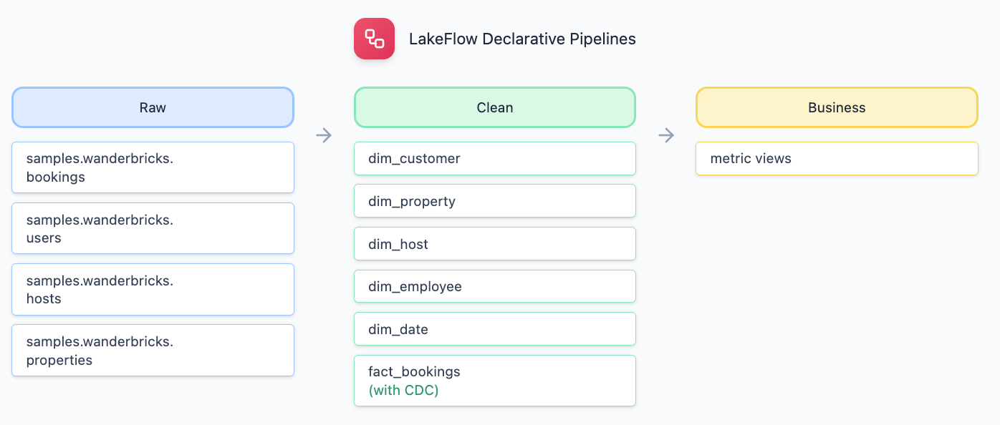

<p align="center">

</p>

# [Microsoft Ignite 2025](https://ignite.microsoft.com)

## LAB531: Accelerate BI with Azure Databricks in the Era of AI

[](https://community.databricks.com/)

### Session Description

In this hands-on lab, you'll build a complete end-to-end data and analytics solution using Azure Databricks and the Microsoft Power BI platform. Using the fictional "Wanderbricks" vacation rental marketplace as your business scenario, you'll transform raw booking data into actionable insights through a modern lakehouse architecture.

You'll create real-time data pipelines with Lakeflow (Databricks' declarative pipeline framework), implement enterprise data governance with Unity Catalog, build AI-powered dashboards using Genie and AI/BI Dashboards, and integrate with Power BI for business intelligence reporting. By the end of this 90-minute workshop, you'll have deployed a production-ready data platform including automated ETL, semantic layers, natural language query capabilities, and a full-stack web application.

This beginner-friendly workshop requires no local installation—everything runs in your browser using Azure Databricks serverless compute and SQL warehouses.

###  Learning Outcomes

By the end of this session, learners will be able to:

- Build automated data pipelines using Lakeflow with built-in data quality checks and change data capture (CDC)
- Implement enterprise data governance using Unity Catalog with catalogs, schemas, and row-level security
- Create semantic layers with Databricks Metric Views for standardized business definitions
- Build interactive dashboards with AI/BI Dashboards and enable natural language queries with Genie AI
- Integrate Azure Databricks with Power BI using DirectQuery for real-time business intelligence
- Deploy full-stack applications on Databricks Apps with FastAPI and React
- Apply medallion architecture patterns (Bronze/Silver/Gold) for lakehouse data organization

###  Technologies Used

1. **Azure Databricks** - Unified analytics platform
2. **Unity Catalog** - Data governance and security
3. **Lakeflow Spark Declarative Pipeline** - Automated ETL pipelines (formerly Delta Live Tables)
4. **Databricks SQL** - SQL analytics engine
5. **Databricks AI/BI Dashboards** - Native BI dashboarding
6. **Genie** - Natural language query interface
7. **Databricks Apps** - Full-stack application hosting
8. **Microsoft Power BI** - Business intelligence reporting

## Content Owners

<table>
<tr>
    <td align="center"><a href="http://github.com/saurabhshukla-db">
        <br />
        <sub><b>Saurabh Shukla</b></sub></a><br />
            <a href="https://github.com/saurabhshukla-db" title="talk">📢</a>
    </td>
    <td align="center"><a href="http://github.com/isaac-gritz">
        <br />
        <sub><b>Isaac Gritz</b></sub></a><br />
            <a href="https://github.com/isaac-gritz" title="talk">📢</a>
    </td>
    <td align="center"><a href="http://github.com/Slcc2c">
        <br />
        <sub><b>Spencer Cook</b></sub></a><br />
            <a href="https://github.com/Slcc2c" title="talk">📢</a>
    </td>
    <td align="center"><a href="http://github.com/bhagyashri333">
        <br />
        <sub><b>Bhagyashri Badgujar</b></sub></a><br />
            <a href="https://github.com/bhagyashri333" title="talk">📢</a>
    </td>
</tr>
</table>

---

# Workshop Guide

**Total Time:** 90 minutes | **Skill Level:** Beginner-friendly

---

## Workshop Timeline

```
0:00 - 0:05  │ Introduction
0:05 - 0:15  │ Setup: Import repo, configure, deploy
0:15 - 0:40  │ Lab 01: Build Lakeflow pipeline (dimensions + facts)
0:40 - 0:50  │ Lab 02: Unity Catalog & metric view (governance)
0:50 - 1:00  │ Lab 03: AI/BI dashboards & Genie
1:00 - 1:10  │ Lab 04: Power BI: Connect to warehouse, quick report
1:10 - 1:20  │ Lab 05:Databricks App: Deploy & open app
1:20 - 1:30  │ Wrap-up, Q&A, next steps
```

---

## Prerequisites

**No local installation required!** Everything runs in your browser.

**Required:**
- Access the LAB environment here: https://labondemand.com/LabProfile/198123 and [Sign up steps here](LAB_SIGNUP.md)
  - **You can also run this lab in Databricks Free Edition** - [Sign up steps here](DATABRICKS_SIGNUP.md) (free, no credit card required)
- Lakeflow Pipelines Editor enabled (Admin → Previews → Lakeflow Pipelines Editor) - [Docs](https://docs.databricks.com/en/ldp/multi-file-editor)
- Databricks Web Terminal Enabled
---

## Quick Start Guide

Follow these steps carefully. Each step includes success checkpoints and troubleshooting.

### Step 1: Import Workshop Code

**Instructions:**
1. In Databricks workspace, click **Workspace** in the left sidebar
2. Click the blue **Create** button (near the bottom)

   

3. Click **Git Folder** button
4. Paste the Git URL provided by your instructor
5. Click **Create Git Folder**

**Success Checkpoint:**
- New folder with Git icon named `ignite_2025`
- Contains `databricks.yml`, `lab/`, `resources/`

**Common Issues:**
- **"Repos not found"**: Repos is not enabled. Ask instructor to enable it.
- **"Authentication failed"**: For private repos, add credentials in User Settings → Git Integration.

---

### Step 2: Run Setup Notebook

**Instructions:**
1. In your imported repo, navigate to **lab** → **00-setup**
2. Open the **01_create_user_resources** notebook
3. **IMPORTANT:** Connect to **Serverless** compute (top-right dropdown → Select "Serverless")

   

4. Click **Run All** at the top (or press Shift+Enter on each cell)
5. Wait for all cells to complete (~2-3 minutes)
6. Scroll to the **final output** (Step 10)

**What this creates:**
-  Catalog: `ignite_2025`
-  Your personal schema: `ignite_2025.<your_username>`
-  Volume: `ignite_2025.<your_username>.file_data`
-  SQL Warehouse: `Serverless Starter Warehouse` - 2X-Small (auto-created if needed)
-  Deployment guide notebook: `02_deploy_lab.ipynb` (personalized with your repo path)

**Success Checkpoint:**
- All cells complete with green checkmarks
- Final output shows catalog, schema, volume, warehouse ID
- Configuration auto-updated in `databricks.yml` and `app.yaml`

**Common Issues:**
- **"Permission denied - CREATE CATALOG"**: Instructor needs to grant catalog creation permission or pre-create the catalog
- **"current_user() returns null"**: You'll need to hardcode your schema name in the next step
- **"ModuleNotFoundError: databricks.sdk"**: You're not connected to Serverless compute - switch to Serverless in the compute dropdown


---

### Step 3: Deploy Workshop Resources

**Recommended: CLI Method (via Web Terminal)**
1. Open the auto-generated notebook: `lab/00-setup/02_deploy_lab.ipynb`
2. Connect to **Serverless** compute

   

3. Go to **View → Cluster Tools → Web Terminal**

   

4. Run the deployment commands shown in the notebook

   

**Alternative: UI Method**
1. Make sure you're in the **repo folder** (should see Git icon)
2. Click **📁 Actions** menu → **Databricks Asset Bundles** → **Deploy**
3. Choose target: **dev**
4. Wait for deployment to complete (~1-2 minutes)

**Note:** You must be in a Git folder (Repos) for bundle deployment to work.

**What gets deployed:**
- 🔄 **Lakeflow Pipeline**: `[dev your_name] wanderbricks_lab_etl`
- 📋 **Orchestration Job**: `[dev your_name] wanderbricks_lab_job`
- 📊 **Dashboard**: `[dev your_name] Wanderbricks Bookings Dashboard`

**Success Checkpoint:**
- "Deployment complete!" message with no errors
- Job visible in **Jobs & Pipelines**: `[dev your_name] wanderbricks_lab_job`


---

### Step 4: Run Workshop Job

**Instructions:**
1. Click **Jobs & Pipelines** in the left sidebar
2. Find your job: `[dev your_name] wanderbricks_lab_job`
3. Click the job name to open it
4. Click the blue **Run Now** button (top right)
5. Watch the job progress in real-time

**What happens (in order):**
1. **Task 1 - Pipeline Full Refresh** (~3-4 minutes):
   - Triggers the Lakeflow pipeline with **full refresh** (rebuilds all tables from scratch)
   - Creates 5 dimension tables + 1 fact table
   - This ensures a clean slate for the workshop
   - You can click into this task to see the pipeline flow diagram
2. **Task 2 - Metric View** (~1 minute):
   - Creates `wanderbricks_bookings_metrics` for AI/BI dashboards

**Success Checkpoint:**
- Job shows "Succeeded" with 2 green tasks
- Total runtime: ~4-6 minutes

**Common Issues:**
- **Job fails on Task 1**: Pipeline may have data quality issues - check pipeline logs
- **Task 2 fails**: Pipeline didn't complete - wait for Task 1 to finish first

---

### Step 5: Deploy Databricks App (Optional)

**Prerequisites:**
- Step 4 (job) must have completed successfully

**Recommended: CLI Method (via Web Terminal)**
1. Open the deployment guide: `lab/00-setup/02_deploy_lab.ipynb`
2. Connect to **Serverless** compute
3. Go to **View → Cluster Tools → Web Terminal**
4. Run the app deployment command shown in the notebook

**Access your app:**
1. **Apps** in left sidebar → Find `wanderbricks-booking-app`
2. Click to open and explore:
   - Property search
   - AI assistant
   - Country manager dashboards

**Success:** App shows "Running" status and loads data

---


**Next:** Dive into the labs to understand what you built!

---

## Lab Modules

### Lab 01: Data Transformation with Lakeflow Pipeline

**🎯 What You'll Build:** A complete medallion architecture pipeline with 5 dimensions and 1 fact table
**💼 Business Value:** Transform raw booking data into analytics-ready tables with data quality guarantees

#### What is Lakeflow Spark Declarative Pipeline?

Lakeflow (formerly called Delta Live Tables / DLT) is Databricks' framework for building reliable, maintainable data pipelines. Think of it as "autopilot for data engineering" - you declare what tables you want and how they relate, and Lakeflow handles the complexity:
- Automatic dependency management
- Built-in data quality checks
- Change data capture (CDC) for tracking updates
- Automatic retries and error handling

#### Architecture: Medallion Layers



#### Step-by-Step Walkthrough

##### 1. Explore Dimension Tables

Open and review these files in [lab/01-Data-Transformation/transformations/](lab/01-Data-Transformation/transformations/):
- `dim_customer.py` - Customer dimension with region mapping and surrogate keys
- `dim_date.py` - Complete date dimension (2020-2030)
- `dim_employee.py` - Employees with roles and tenure
- `dim_host.py` - Hosts with ratings and management styles
- `dim_property.py` - Properties with amenities and pricing tiers

**Key patterns:** `@dp.materialized_view()`, `@dp.expect()` for data quality, `generate_sk()` for surrogate keys

##### 2. Explore Fact Table with CDC

Open [fact_bookings.py](lab/01-Data-Transformation/transformations/fact_bookings.py) to see:
- `dp.create_streaming_table()` for real-time data
- `dp.create_auto_cdc_flow()` for change data capture
- Dimension joins in `fact_bookings_enriched` view

##### 3. Shared Utilities

See [utilities/common_functions.py](lab/01-Data-Transformation/utilities/common_functions.py) for helper functions like `generate_sk()`, `get_region_udf()`, and `get_season()`

##### 4. Monitor Pipeline and Explore Data

1. **Jobs & Pipelines** → Click **wanderbricks_lab_etl** pipeline task
2. Explore **Lakeflow Pipeline UI** tabs: Flow diagram, Lineage, Data quality, Event log
3. **Data Explorer** → `ignite_2025` → `<your_schema>` → Browse tables
4. Query your data in **SQL Editor**: `SELECT * FROM ignite_2025.<your_schema>.dim_customer LIMIT 10;`

#### Success Criteria

- Pipeline completes with all tables green
- Can query 5 dimensions + 1 fact table in Data Explorer

---

### Lab 02: Data Governance with Unity Catalog


**What You'll Build:** Metric views for business users and Power BI integration
**Business Value:** Create a governed semantic layer with standardized metrics

#### What is a Metric View?

A metric view is Unity Catalog's way of creating a **semantic layer** - a business-friendly interface to your data:
- Standard definitions everyone agrees on
- Natural language synonyms for AI queries
- Reusable measures and dimensions
- Centralized governance

**Example:** Instead of each analyst writing different revenue calculations, everyone uses the same certified "Total Revenue" metric.

#### Step-by-Step Walkthrough

##### 1. Understanding Metric Views

**Open:** `lab/02-Data-governance/create_bookings_metrics_view.sql`

##### 2. Explore Your Metric View

**View the metric view:**

1. **Data Explorer** → `ignite_2025` → `<your_schema>` → `wanderbricks_bookings_metrics`
2. Click **Overview** tab
3. Scroll to **Measures** section - see all available measures
4. Scroll to **Dimensions** section - see all grouping columns


#### Success Criteria

- Metric view exists with metrics and dimensions visible in Overview tab
- Can query metric view data

#### Files Reference

- `lab/02-Data-governance/create_bookings_metrics_view.sql`
- `lab/02-Data-governance/unity_catalog_features.md` — Catalog Explorer guide (UI-only) for `fact_bookings`

---

### Lab 03: AI/BI Analytics


**What You'll Build:** Interactive dashboard and AI-powered query interface
**Business Value:** Enable business users to explore data without writing SQL

#### Part A: Databricks AI/BI Dashboard

**What is Databricks AI/BI?**
Databricks AI/BI is a business intelligence solution that uses compound AI to enhance data analysis with self-service insights, governance, and performance.

##### 1. Find Your Dashboard

1. Click **Dashboards** in the left sidebar
2. Search for: `[dev your_name] Wanderbricks Bookings Dashboard`
3. Click to open

**Note:** Your dashboard was automatically deployed in Step 4 of the Quick Start!

##### 2. Explore Dashboard Features

**Interactive features:**
- **Filters**: Try filtering by date range, country, or user type
- **Cross-Filtering**: Click on a chart to filter other visuals

##### 3. Schedule and Share (Optional)

- **Schedule refresh**: Dashboard → Schedule → Daily at 6 AM
- **Share with team**: Dashboard → Share → Add users or groups

#### Part B: Genie Space for Natural Language Queries

**What is Genie?**
Your AI data analyst - ask questions in plain English, get charts and insights automatically.

##### 1. Create Your Genie Space

1. Click **Genie** in the left sidebar
2. Click **New** button
3. **Add data source:**
   - Click **Add data**
   - Navigate to: `ignite_2025` → `<your_schema>` → `wanderbricks_bookings_metrics`
   - Select the metric view
   - Click **Add**
4. Optionally update the **Genie space name** to `Wanderbricks Booking Insights`
5. Click **Create**

For detailed configuration and text instructions, see [create_genie_space.md](lab/03-AI-BI/create_genie_space.md)

##### 2. Sample Questions to Try

**Revenue Analysis:**
- "What is the total revenue by country?"
- "Show me monthly revenue trends for 2024"
- "Which property type generates the most revenue?"

**Booking Patterns:**
- "What's the average booking length by destination?"
- "How many bookings do we have by month?"
- "Show me booking distribution by property type"

**Geographic Insights:**
- "What are the top 10 cities by booking count?"
- "Compare revenue between EMEA and Americas regions"
- "Which country has the highest average booking value?"

##### 3. Understanding Genie Responses

For each query, Genie shows:
1. **SQL Query**: See what Genie generated (learn SQL!)
2. **Results Table**: Raw data
3. **Visualization**: Auto-generated chart
4. **Insights**: AI-generated observations

**Tips for better results:**
- Be specific: "2024 revenue" vs "revenue"
- Use synonyms from your metric view
- Ask follow-up questions to refine

#### Success Criteria

- Dashboard loads with interactive filters
- Genie space answers questions accurately

#### Files Reference

- `lab/03-AI-BI/Wanderbricks Dashboard (using Metric View).lvdash.json.template` - Dashboard template
- `lab/03-AI-BI/create_genie_space.md` - Detailed Genie setup guide

---

### Lab 04: Power BI Integration

**🎯 What You'll Build:** Connect Power BI Desktop to Databricks
**💼 Business Value:** Integrate with existing BI tools and workflows


#### Step-by-Step Connection

##### 1. Get Connection Details

**From Databricks:**
1. Go to **SQL Warehouses** in left sidebar
2. Click your warehouse
3. Click **Connection Details** tab

**Copy these values:**
- Server hostname: `xxxxx.cloud.databricks.com`
- HTTP path: `/sql/1.0/warehouses/xxxxx`

##### 2. Connect Power BI Desktop

1. Open **Power BI Desktop**
2. **Get Data** → **More** → Search "Databricks"
3. Select **Databricks**
4. Enter connection details from step 1
5. Authentication: **OAuth 2.0** (recommended) or **Personal Access Token**

##### 3. Import Tables

1. After connecting, browse to:
   - Catalog: `ignite_2025`
   - Schema: `<your_schema>`
   - Tables: Select dimension and fact tables (e.g., `dim_customer`, `dim_property`, `fact_bookings`)
2. Click **Load** (imports into Power BI)

##### 4. Build Your First Report

**Try these visualizations:**
- **Map**: Bookings by country (use dimension and fact tables)
- **Column chart**: Revenue by property type
- **Line chart**: Bookings over time
- **Card**: Total revenue using DAX measures

#### Success Criteria

- Power BI connects and loads table data
- Can create visualizations

---

### Lab 05: Databricks Apps - Full Stack Application

**🎯 What You'll Build:** Production web application with FastAPI + React
**💼 Business Value:** Deploy customer-facing applications with embedded analytics

#### What is Databricks Apps?

Databricks Apps lets you deploy full-stack applications directly on Databricks:
- **Backend**: Python (FastAPI, Flask, etc.)
- **Frontend**: React, Vue, or any static site
- **Data Access**: Direct SQL Warehouse connection
- **Authentication**: Automatic SSO (Single Sign-On) integration
- **Deployment**: One-command deploy from bundles

**Use cases:**
- Customer-facing dashboards
- Internal tools and admin panels
- Data applications for external stakeholders
- Embedded analytics in products

#### Understanding the Three Personas

The Wanderbricks app demonstrates different implementation levels:

| Persona | Implementation | Data Source |
|---------|----------------|-------------|
| Country Manager | Full Stack (Frontend + Backend + Database) | Real Databricks data via FastAPI backend |
| Customer Data Platform (CDP) | Frontend Only (No backend) | Static hardcoded sample data |
| Demand Forecasting | Frontend Only (No backend) | Static hardcoded sample data |

**Key Points:**
- Country Manager: Production-ready implementation querying your actual pipeline tables (dim_*, fact_bookings)
- CDP (Customer Data Platform) & Demand Forecasting: UI demonstrations with hardcoded data - no backend endpoints or database queries
- This design lets you explore multi-persona concepts without building three complete backends

#### Architecture

```
┌─────────────────────────────────────────┐
│  React Frontend (TypeScript)            │
│  - Property search UI                   │
│  - Dashboard visualizations             │
│  - AI assistant chat                    │
└─────────────────┬───────────────────────┘
                  │ API calls
┌─────────────────▼───────────────────────┐
│  FastAPI Backend (Python)               │
│  - REST API endpoints                   │
│  - Genie AI integration                 │
│  - Dashboard queries                    │
└─────────────────┬───────────────────────┘
                  │ SQL queries
┌─────────────────▼───────────────────────┐
│  Databricks SQL Warehouse               │
│  - samples.wanderbricks tables          │
│  - Your fact/dimension tables           │
└─────────────────────────────────────────┘
```

#### What the App Does

**Wanderbricks Booking Platform:**

1. **Property Search**
   - Browse vacation rentals by destination
   - Filter by dates, guests, price
   - View property details and images

2. **AI Assistant**
   - Natural language search using Genie
   - "Show me beachfront properties in Tokyo under $200/night"
   - Converts queries to property searches

3. **Country Manager Dashboard**
   - 6 performance modules:
     - Market Performance (GBV, revenue, trends)
     - City Performance (top cities, market share)
     - Host Performance (supply metrics, churn)
     - Guest Performance (satisfaction, retention)
     - Property Performance (types, amenities)
     - Operations (employee distribution, support)

#### Explore the Code

See [lab/05-app/backend/main.py](lab/05-app/backend/main.py) for FastAPI endpoints, [app/routers/dashboard.py](lab/05-app/backend/app/routers/dashboard.py) for dashboard logic, and [genie/client.py](lab/05-app/backend/genie/client.py) for AI integration. Frontend is pre-built in `backend/static/`.

#### Deploy the App

**From the repository root:**

```bash
databricks bundle deploy --target dev
databricks bundle run -t dev wanderbricks_booking_app
```

**What happens:**
1. Bundle deploys to Databricks
2. App starts automatically
3. Uses pre-built frontend from `backend/static/`

#### Access Your App

1. Go to **Compute** in the left sidebar, then click **Apps**
2. Find: `wanderbricks-booking-app`
3. Click to open the app URL
4. Explore:
   - Search for properties
   - Try the AI assistant
   - View dashboard analytics


#### Success Criteria

- App deploys and property search loads data
- Dashboard shows metrics

---

## 🎉 Workshop Complete!
---

## Contributing

This project welcomes contributions and suggestions.  Most contributions require you to agree to a
Contributor License Agreement (CLA) declaring that you have the right to, and actually do, grant us
the rights to use your contribution. For details, visit [Contributor License Agreements](https://cla.opensource.microsoft.com).

When you submit a pull request, a CLA bot will automatically determine whether you need to provide
a CLA and decorate the PR appropriately (e.g., status check, comment). Simply follow the instructions
provided by the bot. You will only need to do this once across all repos using our CLA.

This project has adopted the [Microsoft Open Source Code of Conduct](https://opensource.microsoft.com/codeofconduct/).
For more information see the [Code of Conduct FAQ](https://opensource.microsoft.com/codeofconduct/faq/) or
contact [opencode@microsoft.com](mailto:opencode@microsoft.com) with any additional questions or comments.

## Trademarks

This project may contain trademarks or logos for projects, products, or services. Authorized use of Microsoft
trademarks or logos is subject to and must follow
[Microsoft's Trademark & Brand Guidelines](https://www.microsoft.com/legal/intellectualproperty/trademarks/usage/general).
Use of Microsoft trademarks or logos in modified versions of this project must not cause confusion or imply Microsoft sponsorship.
Any use of third-party trademarks or logos are subject to those third-party's policies.
