<p align="center">

</p>

# [Microsoft Ignite 2025](https://ignite.microsoft.com)

## LAB531: Accelerate BI with Azure Databricks in the Era of AI

[](https://community.databricks.com/)

### Session Description

In this hands-on lab, you'll build a complete end-to-end data and analytics solution using Azure Databricks and the Microsoft Power BI platform. Using the fictional "Wanderbricks" vacation rental marketplace as your business scenario, you'll transform raw booking data into actionable insights through a modern lakehouse architecture.

You'll create real-time data pipelines with Lakeflow (Databricks' declarative pipeline framework), implement enterprise data governance with Unity Catalog, build AI-powered dashboards using Genie and AI/BI Dashboards, and integrate with Power BI for business intelligence reporting. By the end of this 90-minute workshop, you'll have deployed a production-ready data platform including automated ETL, semantic layers, natural language query capabilities, and a full-stack web application.

This beginner-friendly workshop requires no local installation—everything runs in your browser using Azure Databricks serverless compute and SQL warehouses.

###  Learning Outcomes

By the end of this session, learners will be able to:

- Build automated data pipelines using Lakeflow with built-in data quality checks and change data capture (CDC)
- Implement enterprise data governance using Unity Catalog with catalogs, schemas, and row-level security
- Create semantic layers with Databricks Metric Views for standardized business definitions
- Build interactive dashboards with AI/BI Dashboards and enable natural language queries with Genie AI
- Integrate Azure Databricks with Power BI using DirectQuery for real-time business intelligence
- Deploy full-stack applications on Databricks Apps with FastAPI and React
- Apply medallion architecture patterns (Bronze/Silver/Gold) for lakehouse data organization

###  Technologies Used

1. **Azure Databricks** - Unified analytics platform
2. **Unity Catalog** - Data governance and security
3. **Lakeflow Spark Declarative Pipeline** - Automated ETL pipelines (formerly Delta Live Tables)
4. **Databricks SQL** - SQL analytics engine
5. **Databricks AI/BI Dashboards** - Native BI dashboarding
6. **Genie** - Natural language query interface
7. **Databricks Apps** - Full-stack application hosting
8. **Microsoft Power BI** - Business intelligence reporting

## Content Owners

<table>
<tr>
    <td align="center"><a href="http://github.com/saurabhshukla-db">
        <br />
        <sub><b>Saurabh Shukla</b></sub></a><br />
            <a href="https://github.com/saurabhshukla-db" title="talk">📢</a>
    </td>
    <td align="center"><a href="http://github.com/isaac-gritz">
        <br />
        <sub><b>Isaac Gritz</b></sub></a><br />
            <a href="https://github.com/isaac-gritz" title="talk">📢</a>
    </td>
    <td align="center"><a href="http://github.com/Slcc2c">
        <br />
        <sub><b>Spencer Cook</b></sub></a><br />
            <a href="https://github.com/Slcc2c" title="talk">📢</a>
    </td>
    <td align="center"><a href="http://github.com/bhagyashri333">
        <br />
        <sub><b>Bhagyashri Badgujar</b></sub></a><br />
            <a href="https://github.com/bhagyashri333" title="talk">📢</a>
    </td>
</tr>
</table>

---

# Workshop Guide

**Total Time:** 90 minutes | **Skill Level:** Beginner-friendly

---

## Workshop Timeline

```
0:00 - 0:05  │ Introduction
0:05 - 0:15  │ Setup: Import repo, configure, deploy
0:15 - 0:40  │ Lab 01: Data Transformation with Lakeflow Pipeline
0:40 - 0:50  │ Lab 02: Data Governance with Unity Catalog
0:50 - 1:00  │ Lab 03: Intelligent analytics with AI/BI dashboards & Genie
1:00 - 1:10  │ Lab 04: Publish data from Azure Databricks to Power BI service
1:10 - 1:20  │ Lab 05: Databricks App: Deploy & Explore app
1:20 - 1:30  │ Wrap-up, Q&A, next steps
```

---

## Prerequisites

**No local installation required!** Everything runs in your browser.

**Required:**
- Access the LAB environment here: https://labondemand.com/LabProfile/198123 and [Sign up steps here](LAB_SIGNUP.md)
  - **You can also run this lab in Databricks Free Edition** - [Sign up steps here](DATABRICKS_SIGNUP.md) (free, no credit card required)
- Lakeflow Pipelines Editor enabled (Admin → Previews → Lakeflow Pipelines Editor) - [Docs](https://docs.databricks.com/en/ldp/multi-file-editor)
- New pipeline monitoring: ON (toggle in pipeline UI top bar)
- Databricks Web Terminal Enabled
---

## Quick Start Guide

Follow these steps carefully. Each step includes success checkpoints and troubleshooting.

### Step 1: Import Workshop Code

**Instructions:**
1. In Databricks workspace, click **Workspace** in the left sidebar
2. Click the blue **Create** button

   

3. Click **Git Folder** button
4. Paste this Git URL: `https://github.com/microsoft/ignite25-LAB531-accelerate-bi-with-azure-databricks-in-the-era-of-ai.git`
5. Click **Create Git Folder**

---

### Step 2: Run Setup Notebook

**Instructions:**
1. In your imported repo, navigate to **lab** → **00-setup**
2. Open the **01_create_user_resources** notebook
3. **IMPORTANT:** Connect to **Serverless** compute (top-right dropdown → Select "Serverless")

   

4. Click **Run All** at the top (or press Shift+Enter on each cell)
5. Wait for all cells to complete (~2-3 minutes)
6. Scroll to the **final output** (Step 10)

**What this creates:**
-  Catalog: `adb_lab531_<user_id>` (auto-generated from your email, e.g., `adb_lab531_56748340`)
-  Your personal schema: `<your_catalog>.<your_username>`
-  Volume: `<your_catalog>.<your_username>.file_data`
-  SQL Warehouse: `Serverless Starter Warehouse` - 2X-Small (auto-created if needed)
-  Deployment guide notebook: `02_deploy_lab.ipynb` (personalized with your repo path)
-  Updates `databricks.yml` with your catalog name (auto-propagates to pipeline and job)


---

### Step 3: Deploy Workshop Resources

**Recommended: CLI Method (via Web Terminal)**
1. Open the auto-generated notebook: `lab/00-setup/02_deploy_lab.ipynb`

   **Important:** When you open the file, you'll see a popup warning about "Jupyter (IPYNB) notebook problem". Click **"open as a notebook"** to view it correctly.

   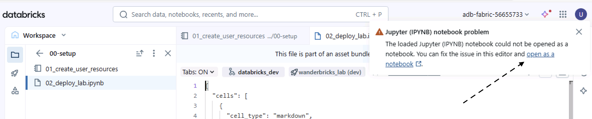

2. Connect to **Serverless** compute

   

3. Go to **View → Cluster Tools → Web Terminal**

   

4. Run the deployment commands shown in the notebook

   

**Alternative: UI Method**
1. Click **Deployments** in the left sidebar
2. Click **Deploy** button
3. Choose target: **dev**
4. Wait for deployment to complete (~1-2 minutes)

   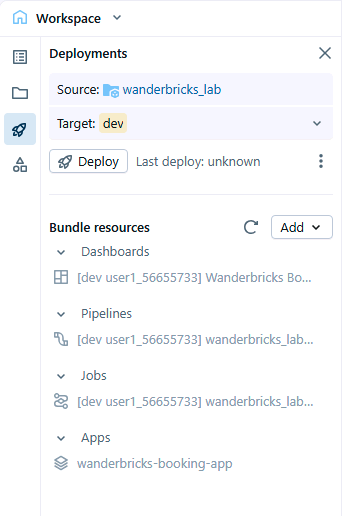

**What gets deployed:**
-  **Lakeflow Pipeline**: `[dev your_name] wanderbricks_lab_etl`
-  **Orchestration Job**: `[dev your_name] wanderbricks_lab_job`
-  **Dashboard**: `[dev your_name] Wanderbricks Bookings Dashboard`
-  **App**: `wanderbricks-booking-app`


---

### Step 4: Run Workshop Job

**Instructions:**
1. Click **Jobs & Pipelines** in the left sidebar
2. Find your job: `[dev your_name] wanderbricks_lab_job`
3. Click the job name to open it
4. Click the blue **Run Now** button (top right)
5. Watch the job progress in real-time

**What happens (in order):**
1. **Task 1 - Pipeline Full Refresh** (~3-4 minutes):
   - Triggers the Lakeflow pipeline with **full refresh** (rebuilds all tables from scratch)
   - Creates 5 dimension tables + 1 fact table
   - This ensures a clean slate for the workshop
   - You can click into this task to see the pipeline flow diagram
2. **Task 2 - Metric View** (~1 minute):
   - Creates `wanderbricks_bookings_metrics` for AI/BI dashboards


---

### Step 5: Deploy Databricks App (Required for UI Deployment Only)


**If you used CLI deployment (Web Terminal):** The app was already deployed automatically in Command 3. Skip to "Access your app" below.

**If you used UI deployment (Deployments sidebar):** Follow these steps to start and deploy the app:

1. Click **Compute** in the left sidebar
2. Go to **Apps** tab
3. Find `wanderbricks-booking-app`
   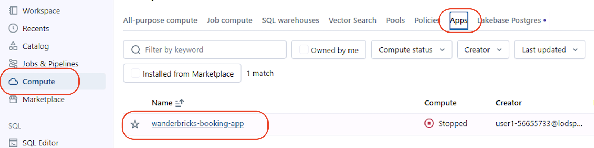
4. Click the blue **Start** button [ This process may take 2 to 3 minutes. ]
5. Click **Deploy** button and select the `backend` folder when prompted

   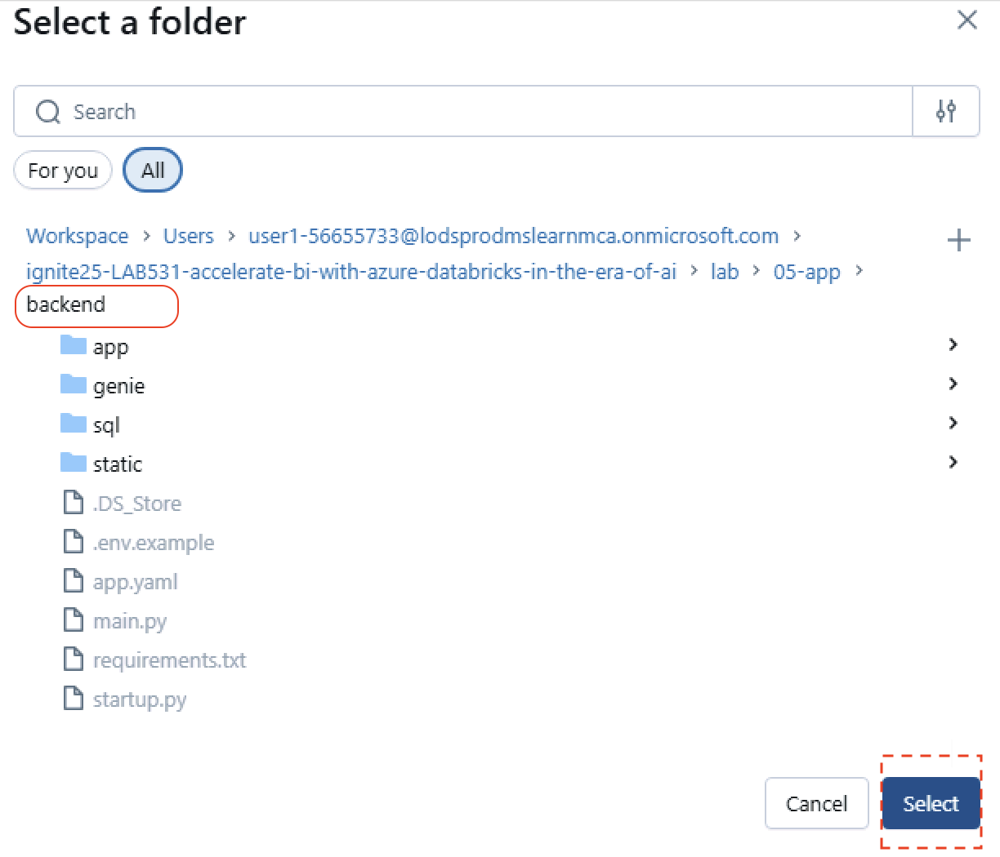

   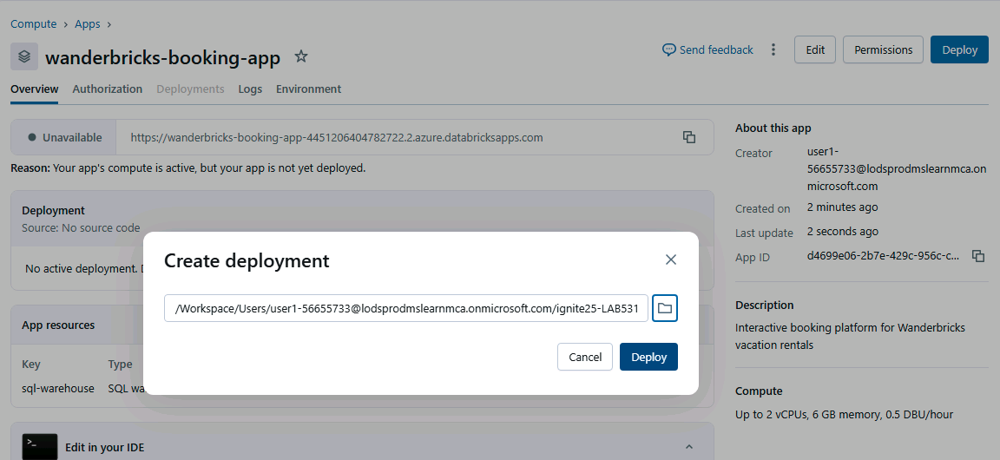
7. Wait for deployment to complete

**Access your app:**
1. **Apps** in left sidebar → Find `wanderbricks-booking-app`
2. Click to open and explore:
   - Property search
   - AI assistant
   - Country manager dashboards

**Success:** App shows "Running" status and loads data

---


**Next:** Dive into the labs to understand what you built!

---

## Lab Modules

### Lab 01: Data Transformation with Lakeflow Pipeline

** What You'll Build:** A complete medallion architecture pipeline with 5 dimensions and 1 fact table
** Business Value:** Transform raw booking data into analytics-ready tables with data quality guarantees

#### What is Lakeflow Spark Declarative Pipeline?

Lakeflow Spark Declarative Pipelines is a declarative framework for developing and running batch and streaming data pipelines in SQL and Python.

#### Architecture: Medallion Layers


#### Step-by-Step Walkthrough

##### 1. Explore Dimension Tables

Open and review these files in [lab/01-Data-Transformation/transformations/](lab/01-Data-Transformation/transformations/):
- `dim_customer.py` - Customer dimension with region mapping and surrogate keys
- `dim_date.py` - Complete date dimension (2020-2030)
- `dim_employee.py` - Employees with roles and tenure
- `dim_host.py` - Hosts with ratings and management styles
- `dim_property.py` - Properties with amenities and pricing tiers

**Key patterns:** `@dp.materialized_view()`, `@dp.expect()` for data quality, `generate_sk()` for surrogate keys

##### 2. Explore Fact Table with CDC

Open [fact_bookings.py](lab/01-Data-Transformation/transformations/fact_bookings.py) to see:
- `dp.create_streaming_table()` for real-time data
- `dp.create_auto_cdc_flow()` for change data capture
- Dimension joins in `fact_bookings_enriched` view

##### 3. Shared Utilities

See [utilities/common_functions.py](lab/01-Data-Transformation/utilities/common_functions.py) for helper functions like `generate_sk()`, `get_region_udf()`, and `get_season()`

##### 4. Monitor Pipeline and Explore Data

1. **Jobs & Pipelines** → Click **wanderbricks_lab_etl** pipeline task
2. Enable **New pipeline monitoring: ON** (toggle in top bar)

   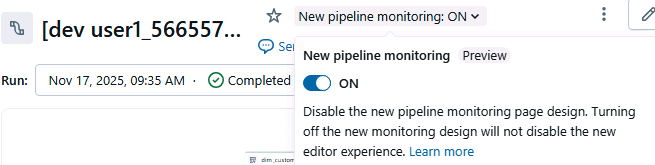

3. Explore **Lakeflow Pipeline UI** tabs: Flow diagram, Lineage, Data quality, Event log

   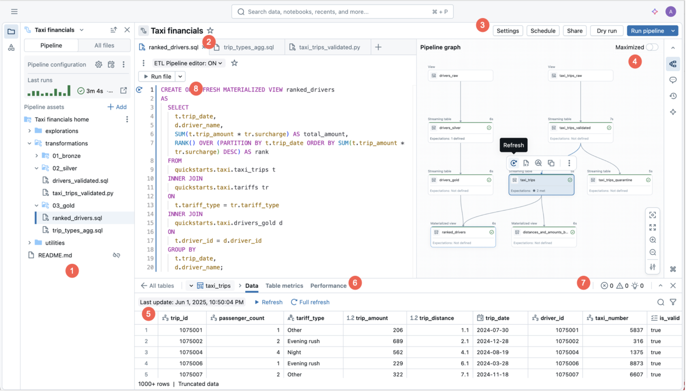


---

### Lab 02: Data Governance with Unity Catalog

**What You'll Explore:** Unity Catalog features and metric views

#### Part A: Explore Table with Catalog Explorer

1. Click **Catalog** in the left sidebar
2. Navigate: `<your_catalog>` → `<your_schema>` → `dim_customer`

   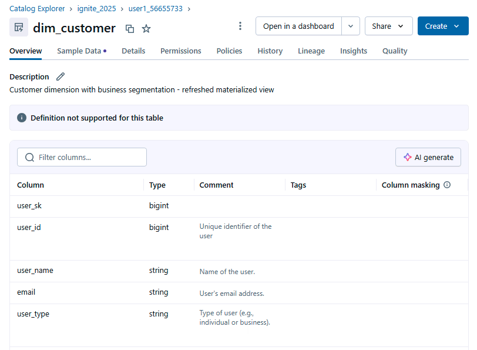

3. Explore each tab:
   - **Overview**: Table description and schema
   - **Sample Data**: Preview table rows
   - **Details**: Table properties and location
   - **Permissions**: Access control settings
   - **Lineage**: Data flow and dependencies

4. Generate column descriptions:
   - Click **AI generate** button (top right)
   - Review auto-generated descriptions for each column

#### Part B: Explore Metric View with Catalog Explorer

**What is a Metric View?**
Metric views provide centralized definitions for business metrics, ensuring everyone uses the same calculations.

1. Navigate: `<your_catalog>` → `<your_schema>` → `wanderbricks_bookings_metrics`
2. Click **Overview** tab:
   - See all **Measures** (metrics like Total Revenue, Total Bookings)
   - See all **Dimensions** (grouping columns like Country, Property Type)
3. Click **Details** tab:
   - View the YAML definition
   - See how measures and dimensions are configured
   - Notice the joins to dimension tables


---

### Lab 03: Intelligent analytics with AI/BI dashboards & Genie


**What You'll Build:** Interactive dashboard and AI-powered query interface
**Business Value:** Enable business users to explore data without writing SQL

#### Part A: Databricks AI/BI Dashboard

**What is Databricks AI/BI?**
Databricks AI/BI is a business intelligence solution that uses compound AI to enhance data analysis with self-service insights, governance, and performance.

##### 1. Find Your Dashboard

1. Click **Dashboards** in the left sidebar
2. Search for: `[dev your_name] Wanderbricks Bookings Dashboard`
3. Click to open

**Note:** Your dashboard was automatically deployed in Step 4 of the Quick Start!

##### 2. Explore Dashboard Features

**Interactive features:**
- **Filters**: Try filtering by date range, country, or user type
- **Cross-Filtering**: Click on a chart to filter other visuals

##### 3. Schedule and Share (Optional)

- **Schedule refresh**: Dashboard → Schedule → Daily at 6 AM
- **Share with team**: Dashboard → Share → Add users or groups

#### Part B: Genie Space for Natural Language Queries

**What is Genie?**
AI/BI Genie provides a conversational interface for querying your data using natural language. 

##### 1. Create Your Genie Space

1. Click **Genie** in the left sidebar
2. Click **New** button
3. **Connect your Data:**
   - Navigate to: `<your_catalog>` → `<your_schema>` → `wanderbricks_bookings_metrics`
   - Select the metric view
   - Click **Create**
4. Optionally update the **Genie space name** to `Wanderbricks Booking Insights`

##### 2. Configure Genie Space

1. Click **Settings** tab and save description:
   ```
   This Genie space provides comprehensive analytics for the Wanderbricks travel booking platform
   using a metric view with pre-defined dimensions and measures.
   ```

2. Click **Instructions** tab -> Text and save:
   ```
   METRIC VIEW USAGE:
   - Use MEASURE() function to access pre-defined metrics like Total Bookings, Total Revenue, Cancellation Rate
   - Focus on 2025 data by default
   ```

3. Set **Default warehouse**: Select your SQL warehouse (serverless recommended)

##### 3. Test with Sample Questions

Click **New Chat** and try these queries:

**Note:** If you see a warning about the warehouse being stopped, click **Start Warehouse** to enable queries.

   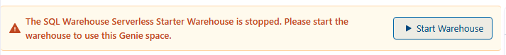
**Revenue & Performance:**
- "What is the total revenue for 2025?"
- "Show me monthly revenue trends by customer region"
- "Which property type generates the most revenue in 2025?"

**Booking Analysis:**
- "What's the average booking length by city?"
- "What's the cancellation rate by season in 2025?"

**Property & Host Insights:**
- "Which cities have the most bookings in 2025?"
- "Show me properties with the highest revenue per night"

##### 4. Understanding Genie Responses

For each query, Genie shows:
1. **SQL Query**: See what Genie generated (learn SQL!)
2. **Results Table**: Raw data
3. **Visualization**: Auto-generated chart
4. **Insights**: AI-generated observations


---

### Lab 04: Publish data from Azure Databricks to Power BI service

#### Part A: Import Existing Report to Power BI Service

##### 1. Download Power BI Report from Databricks

1. In Databricks, navigate to your Git repo folder
2. Go to `lab/04-PowerBI/`
3. Right-click on `wanderbricks_ignite_direct_query_demo - v3.pbix`
4. Click **Download** to save the file to your computer

##### 2. Login to Microsoft Fabric

1. Navigate to **https://fabric.microsoft.com** and sign up for free trial.

##### 3. Import Existing Power BI Model and Report

1. Click **My workspace**
2. Click **Import** → **Report**

   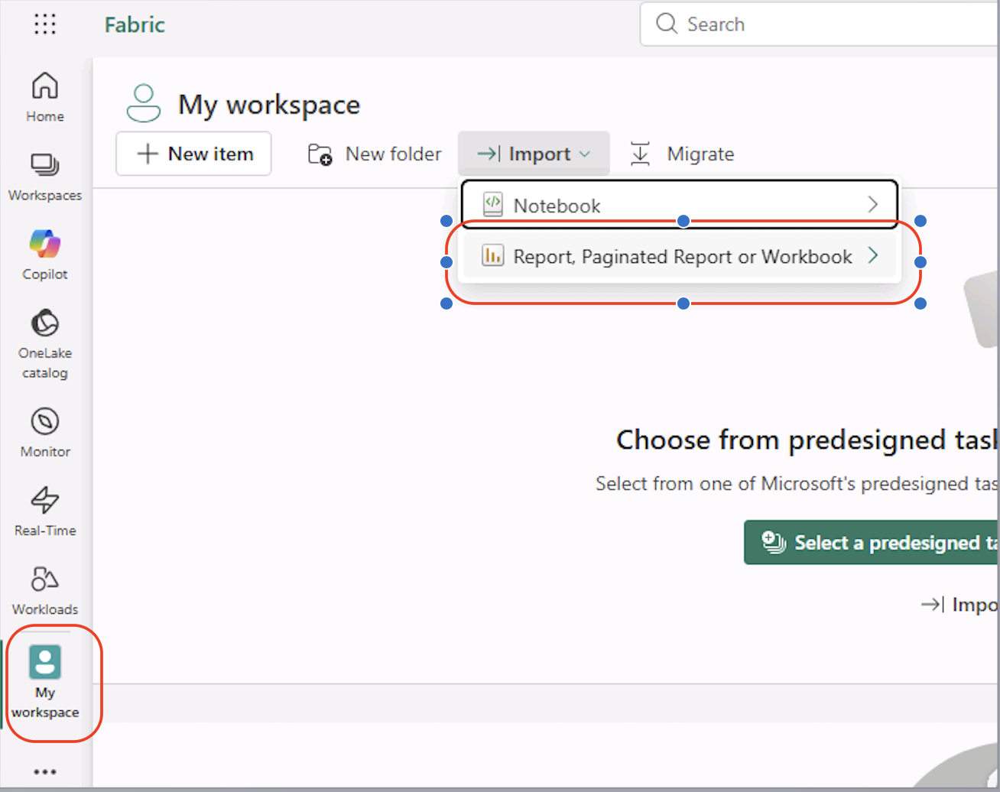

3. Click **Browse** and select the downloaded `.pbix` file from your computer

##### 4. Update Data Source Parameters

1. After import, click **Settings** (gear icon) on the report
      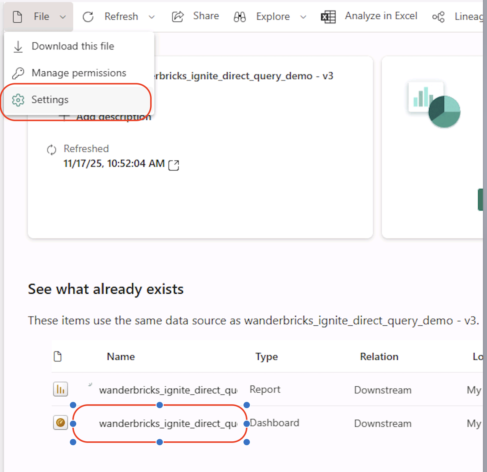


2. Update parameters with your SQL Warehouse connection details:
   - **Server hostname**: Get from Databricks → SQL Warehouses → Connection Details
   - **HTTP path**: Get from Databricks → SQL Warehouses → Connection Details
   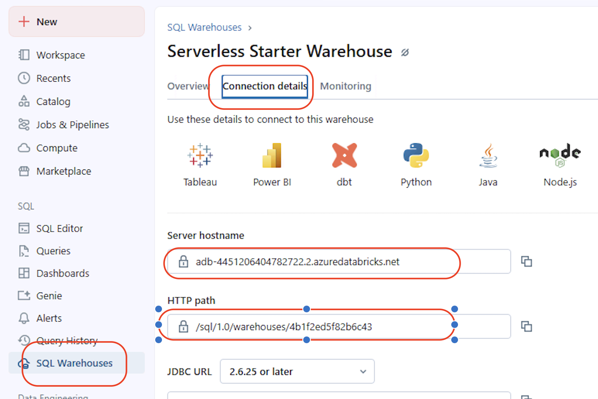
##### 5. Configure Credentials

1. Click **Edit credentials**
2. Select **OAuth 2.0** authentication
3. Sign in with your Databricks account
   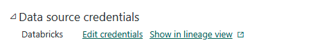
##### 6. Open and Explore Report

1. Click on the report to open it
2. The report uses **DirectQuery mode**
3. Interact with visualizations and filters to see real-time data

   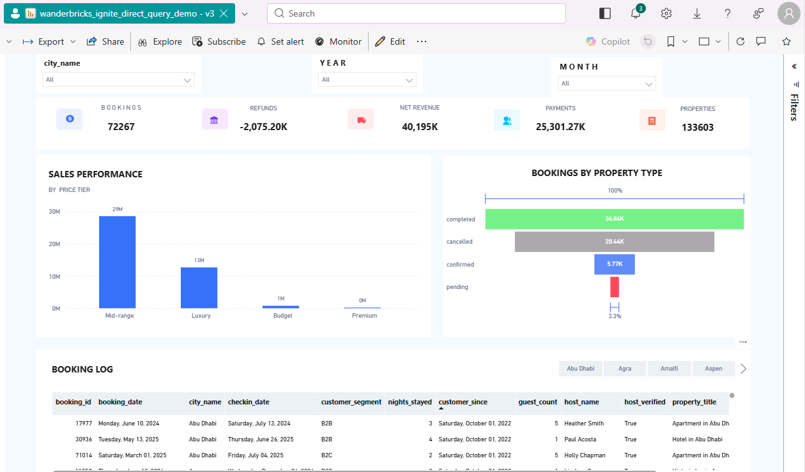


---

### Lab 05: Databricks App: Deploy & Explore app

#### What is Databricks Apps?

Databricks Apps lets you deploy full-stack applications directly on Databricks.

#### Wanderbricks App -  Three Personas

The Wanderbricks app demonstrates different implementation levels:

| Persona | Implementation | Data Source |
|---------|----------------|-------------|
| Country Manager | Full Stack (Frontend + Backend + Database) | Real Databricks data via FastAPI backend |
| Customer Data Platform (CDP) | Frontend Only (No backend) | Static hardcoded sample data |
| Demand Forecasting | Frontend Only (No backend) | Static hardcoded sample data |

**Country Manager Dashboard:**

Real Databricks data via FastAPI backend - Production-ready implementation querying your actual pipeline tables (dim_*, fact_bookings)

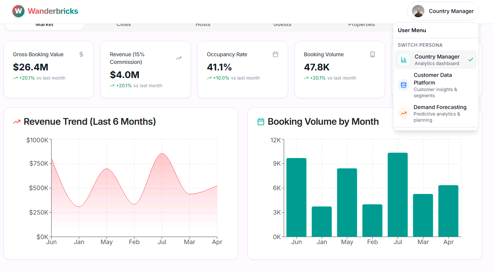

**Customer Data Platform (CDP):**

Frontend only with static hardcoded sample data - no backend endpoints or database queries

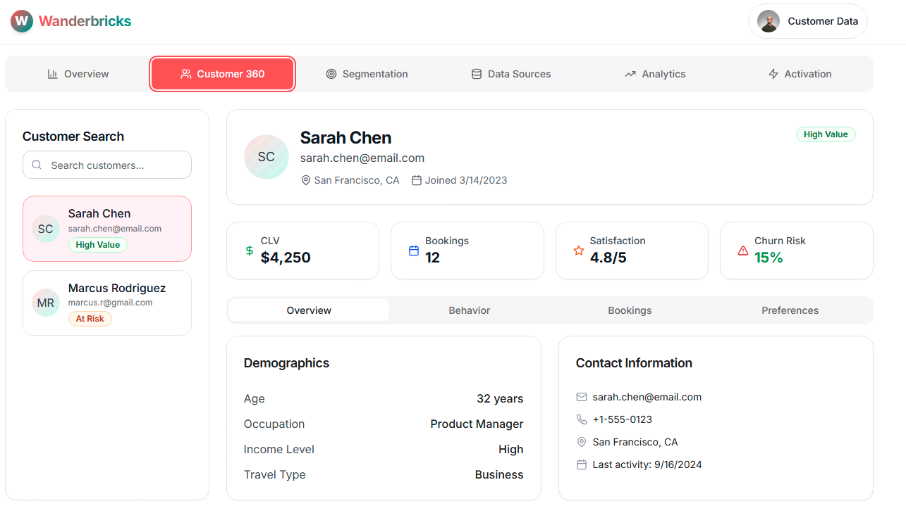

**Demand Forecasting:**

Frontend only with static hardcoded sample data - no backend endpoints or database queries

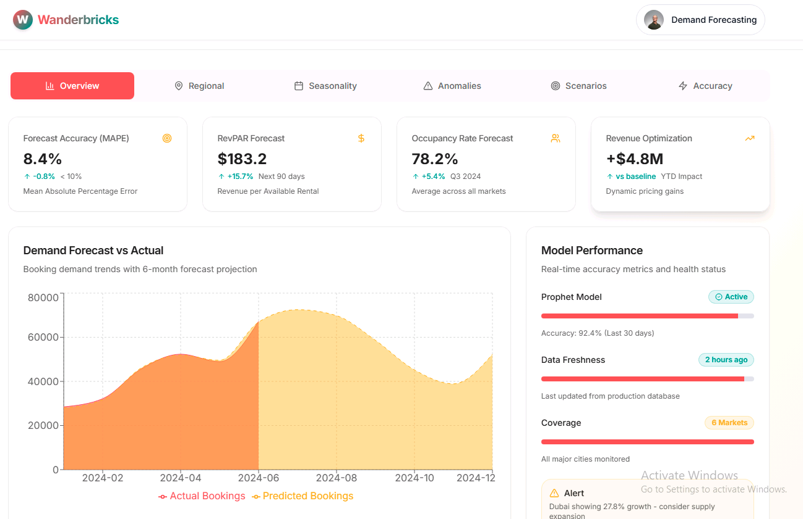

#### Access Your App

1. Go to **Compute** in the left sidebar, then click **Apps**
2. Find: `wanderbricks-booking-app`
3. Click to open the app URL
4. Explore:
   - Search for properties
   - Try the AI assistant
   - View dashboard analytics


#### Explore the Code

See [lab/05-app/backend/main.py](lab/05-app/backend/main.py) for FastAPI endpoints, [app/routers/dashboard.py](lab/05-app/backend/app/routers/dashboard.py) for dashboard logic, and [genie/client.py](lab/05-app/backend/genie/client.py) for AI integration. Frontend is pre-built in `backend/static/`.

#### Success Criteria

- App deploys and property search loads data
- Dashboard shows metrics

---

## 🎉 Workshop Complete!
---

## Contributing

This project welcomes contributions and suggestions.  Most contributions require you to agree to a
Contributor License Agreement (CLA) declaring that you have the right to, and actually do, grant us
the rights to use your contribution. For details, visit [Contributor License Agreements](https://cla.opensource.microsoft.com).

When you submit a pull request, a CLA bot will automatically determine whether you need to provide
a CLA and decorate the PR appropriately (e.g., status check, comment). Simply follow the instructions
provided by the bot. You will only need to do this once across all repos using our CLA.

This project has adopted the [Microsoft Open Source Code of Conduct](https://opensource.microsoft.com/codeofconduct/).
For more information see the [Code of Conduct FAQ](https://opensource.microsoft.com/codeofconduct/faq/) or
contact [opencode@microsoft.com](mailto:opencode@microsoft.com) with any additional questions or comments.

## Trademarks

This project may contain trademarks or logos for projects, products, or services. Authorized use of Microsoft
trademarks or logos is subject to and must follow
[Microsoft's Trademark & Brand Guidelines](https://www.microsoft.com/legal/intellectualproperty/trademarks/usage/general).
Use of Microsoft trademarks or logos in modified versions of this project must not cause confusion or imply Microsoft sponsorship.
Any use of third-party trademarks or logos are subject to those third-party's policies.
